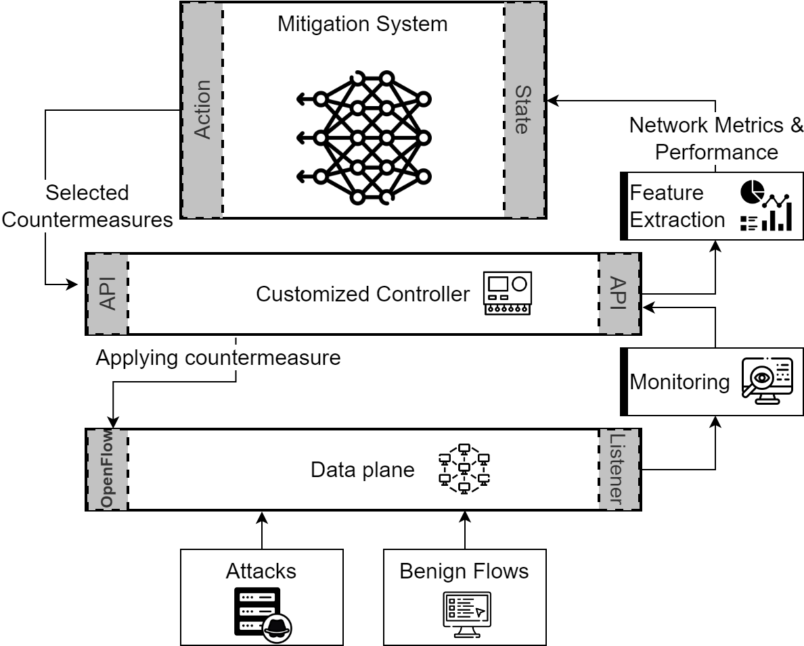

# RL Countermeasures selection for mitigating DDoS attacks in SDN networks

## Introduction

5G represents the most recent and sophisticated generation of mobile
communications. It boasts features such as rapid response times, minimal latency,
and substantial bandwidth.
These networks are increasing sharply in size as well as in functionality,
especially with the growth of the Internet of Things, which gave rise to
numerous challenges. Nowadays attackers are developing diverse techniques to
exploit vulnerable gaps like insufficient traffic monitoring and access
controls through the network. It became mandatory to define appropriate
countermeasures in order to defend these networks against different attack types.
In the article for which this project was implemented, we are using Double Deep Q-Network (DDQN) which is a
reinforcement learning (RL) algorithm that aims to mitigate DDoS attacks in
SDN as it is the backbone of 5G networks since it enables network administrators
to centralize control and management of the network

## Table of contents

- [RL Countermeasures selection for mitigating DDoS attacks in SDN networks](#rl-countermeasures-selection-for-mitigating-ddos-attacks-in-sdn-networks)
  * [Introduction](#introduction)
  * [Table of contents](#table-of-contents)
  * [System Architecture](#system-architecture)
  * [Pseudo code](#pseudo-code)
  * [Modules](#modules)
    + [Mininet Network](#mininet-network)
    + [Reinforcement Learning](#reinforcement-learning)
    + [Tools - Hosts Topology Generator](#tools---hosts-topology-generator)
  * [Requirements](#requirements)
  * [License](#license)
  * [Acknowledgments](#acknowledgments)

## System Architecture



## Pseudo code

```plaintext
BEGIN
  Initialize the Mininet environment with the specified network topology
  Set up the Double Deep Q-Network (DDQN)
  FOR each episode in the training sessions:
    Reset the network to the initial state
    WHILE the network is active:
      Observe the current state of the network
      Select an action based on the current state using the DDQN model
      Execute the selected action in the Mininet environment
      Observe the new state and reward from the network
      Update the DDQN model with the new state and reward
    END WHILE
  END FOR
  Evaluate the performance of the trained model
END
```

## Modules

### Mininet Network
A Mininet-based network topology with an exposed Flask API.

For more details, refer to the corresponding [README.md](network/README.md) file.

### Reinforcement Learning
A whole simulation and training process that depends on the Network module.

For more details, refer to the corresponding [README.md](reinforcement/README.md) file.

### Tools - Hosts Topology Generator
A python script to generate a JSON topology file for hosts.

For more details, refer to the corresponding [README.md](tools/hoststopo/README.md) file.

## Requirements

To be able to run the project, you should have:

- **Ubuntu 20.04 LTS**:
  - Running as a main system or inside a VM.
- **Python v3.8**:
  - Requirements at [requirements.txt](requirements.txt).
- **Mininet v2.2.2**:
  - From [Mininet official website](https://mininet.org/download/).
- **Apache Maven 3.6.3**.
- **Gradle v4.4.1**.
- **JDK v1.8**:
  - Tested with Openjdk V 1.8.0_422.
- **CICFlowMeter v4.0**:
  - From [CICFlowMeter Github Repository](https://github.com/CanadianInstituteForCybersecurity/CICFlowMeter).
- **MHDDoS v2.4.1**:
  - From [MHDDoS Github Repository](https://github.com/MatrixTM/MHDDoS).
- **TShark 3.2.3**:
  - Git v3.2.3 packaged as 3.2.3-1.

## License

This project is licensed under the GNU License - see the [LICENSE.md](LICENSE) file for details.

## Acknowledgments

- Thanks to the contributors and maintainers of the Mininet, MHDDoS, and CICFlowMeter projects.
- Special thanks to the team and advisors who provided insights and expertise that greatly assisted the research.
- Gratitude to all who provided feedback and suggestions that improved this project.
